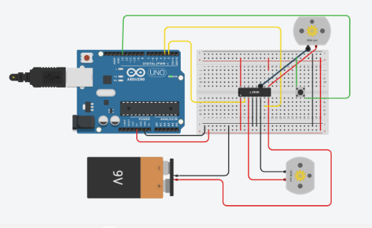

# DC-Motor-Speed-Control-Using-Arduino
### AIM : 
To control the speed and the direction of a DC motor using L293D driver ic( H- bridge)

### Components Required:
•	Arduino UNO board
•	L293D driver
•	12V DC motor
•	10K ohm potentiometer
•	Pushbutton
•	12V source
•	Breadboard
•	Jumper wires
### THEORY 
The L293D quadruple half-H drivers chip allows us to drive 2 motors in both directions, with two PWM outputs from the Arduino we can easily control the speed as well as the direction of rotation of one DC motor. (PWM: Pulse Width Modulation).
Arduino DC motor control circuit:
Project circuit schematic diagram is the one below.


FIGURE-01 H BRIDGE CIRUCIT INTERFACE 
 
The speed of the DC motor (both directions) is controlled with the 10k potentiometer which is connected to analog channel 0 (A0) and the direction of rotation is controlled with the push button which is connected to pin 8 of the Arduino UNO board. If the button is pressed the motor will change its direction directly.
The L293D driver has 2 VCCs: VCC1 is +5V and VCC2 is +12V (same as motor nominal voltage). Pins IN1 and IN2 are the control pins where:

TABLE-01 EXITATION TABLE FOR H BRIDGE 

As shown in the circuit diagram we need only 3 Arduino terminal pins, pin 8 is for the push button which toggles the motor direction of rotation. Pins 9 and 10 are PWM signal outputs, at any time there is only 1 active PWM, this allows us to control the direction as well as the speed by varying the duty cycle of the PWM signal. The active PWM pin decides the motor direction of rotation (one at a time, the other output is logic 0).

### PRGORAM 
```
DEVELOPED BY: DHARANI ELANGO
REGISTER NO:212221230021
```
```
const int button1 = 4; 
const int button2 = 5; 
int buttonstate1 = 0;
int buttonstate2 = 0;
void setup()

{
   
pinMode(2,OUTPUT); 
pinMode(3,OUTPUT); 
pinMode(8,OUTPUT);
pinMode(9,OUTPUT); 
pinMode(button1,INPUT);
pinMode(button2,INPUT); 

}

void loop()
{
    buttonstate1 = digitalRead(button1);
        buttonstate2 = digitalRead(button2);


  if (buttonstate1 == HIGH){

    digitalWrite(8,HIGH);
        digitalWrite(9,LOW);
    delay(5000);
  }

    else {

          digitalWrite(8,LOW);
              digitalWrite(9,HIGH);
      
    }
if (buttonstate2 == HIGH){

    digitalWrite(2,HIGH);
        digitalWrite(3,LOW);
  delay(5000);
}

    else {

          digitalWrite(2,LOW);
              digitalWrite(3,HIGH);
      
    }

}
```
### OUTPUT


### RESULTS 
The speed and the direction of a DC motor has been controlled using L293D driver ic( H- bridge).

